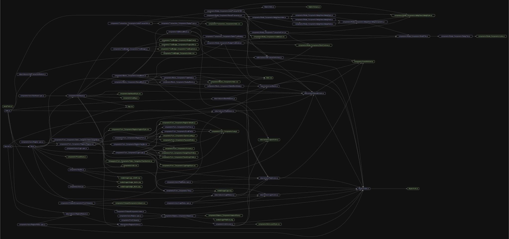

# budget blocks

## Front end documentation

## Modules

<dl>
<dt><a href="#module_dispatch/urls">dispatch/urls</a> ⇒ <code>Urls</code></dt>
<dd></dd>
<dt><a href="#LANG
- A module for words viewable to the end-user.module_">LANG
- A module for words viewable to the end-user.</a></dt>
<dd></dd>
</dl>

## Constants

<dl>
<dt><a href="#default_user">default_user</a> ⇒</dt>
<dd>
Register/default_user

</dd>
<dt><a href="#default_values">default_values</a> ⇒</dt>
<dd>
Register/default_values

</dd>
<dt><a href="#Login">Login</a></dt>
<dd>
Login (React Component)

</dd>
</dl>

## Functions

<dl>
<dt><a href="#PasswordField">PasswordField(name, placeholder, label, value, handleChange, error, helperText)</a></dt>
<dd>
<code>PasswordField</code> is a convenience wrapper around several components.

</dd>
<dt><a href="#RegForm">RegForm(rProps, rState, rConfirm, rSubmit, rUserChange)</a> ⇒</dt>
<dd>
<code>RegForm</code> is a convenience wrapper
around several components that comprise
the new user registration form.

</dd>
<dt><a href="#clearState">clearState(state, setState)</a></dt>
<dd>
clearState will callback <code>setState</code> with default values.

</dd>
<dt><a href="#handleUserChange">handleUserChange(e, state, setState)</a></dt>
<dd>
handleUserChange will callback <code>setState</code> to update <code>state.user</code>.

</dd>
<dt><a href="#handleConfirm">handleConfirm(e, state, setState)</a></dt>
<dd>
handleConfirm will callback <code>setState</code> to update <code>state.confirmPass</code>.

</dd>
<dt><a href="#handleSubmit">handleSubmit(e, state, setState, props)</a></dt>
<dd>
handleSubmit will callback <code>setState</code> to update <code>state.confirmPass</code>.

</dd>
<dt><a href="#GenText">GenText(langKey, handleChange, value, error, helperText, fullWidth, variant, id)</a></dt>
<dd>
TextField with Label

</dd>
<dt><a href="#FirstOnboard">FirstOnboard(history, isFetching, error, linkedAccount, userId)</a></dt>
<dd>
FirstOnboard

after logging in &amp; prior to the dashboard;
a virtual &quot;waiting room&quot; for the end-user.

</dd>
<dt><a href="#ymdNow">ymdNow()</a> ⇒ <code>String</code></dt>
<dd>
ymdNow()

todays date, formatted <code>YYYY-MM-DD</code>

</dd>
</dl>

## dispatch/urls ⇒ <code>Urls</code>
**Returns**: <code>Urls</code> - environment specific URL(s)  

### dispatch/urls~Urls ⇒ <code>Urls</code>
**Kind**: inner constant of [<code>dispatch/urls</code>](#module_dispatch/urls)  
**Returns**: <code>Urls</code> - environment specific URL(s)  

## LANG
- A module for words viewable to the end-user.

## default\_user ⇒
Register/default_user

**Kind**: global constant  
**Returns**: default Register component state.user  

## default\_values ⇒
Register/default_values

**Kind**: global constant  
**Returns**: default Register component state.values  

## Login
Login (React Component)

**Kind**: global constant  
**Renders**: login page  

| Param | Type |
| --- | --- |
| props | <code>\*</code> | 

## PasswordField(name, placeholder, label, value, handleChange, error, helperText)
`PasswordField` is a convenience wrapper around several components.

**Kind**: global function  

| Param | Type | Description |
| --- | --- | --- |
| name | <code>String</code> | (internal) |
| placeholder | <code>String</code> | visible when field is empty |
| label | <code>String</code> | user-friendly label of this field |
| value | <code>String</code> | current value of this field |
| handleChange | <code>function</code> | called when `value` changes |
| error | <code>Boolean</code> | when true, the label will be displayed in an error state. |
| helperText | <code>String</code> | insight about this field & it's current state |

## RegForm(rProps, rState, rConfirm, rSubmit, rUserChange) ⇒
`RegForm` is a convenience wrapper
around several components that comprise
the new user registration form.

**Kind**: global function  
**Returns**: <form className="RegisterForm" ... />  

| Param | Type | Description |
| --- | --- | --- |
| rProps | <code>Object</code> | React component props |
| rState | <code>Object</code> | React component state |
| rConfirm | <code>function</code> | callback => validate |
| rSubmit | <code>function</code> | callback => validate & submit |
| rUserChange | <code>function</code> | callback => validate & update |

## clearState(state, setState)
clearState will callback `setState` with default values.

**Kind**: global function  

| Param | Type | Description |
| --- | --- | --- |
| state | <code>Object</code> | form data |
| setState | <code>function</code> | callback to update `state` |

## handleUserChange(e, state, setState)
handleUserChange will callback `setState` to update `state.user`.

**Kind**: global function  

| Param | Type | Description |
| --- | --- | --- |
| e | <code>Event</code> | the event |
| state | <code>Object</code> | form data |
| setState | <code>function</code> | callback to update `state` |

## handleConfirm(e, state, setState)
handleConfirm will callback `setState` to update `state.confirmPass`.

**Kind**: global function  

| Param | Type | Description |
| --- | --- | --- |
| e | <code>Event</code> | the event |
| state | <code>Object</code> | form data |
| setState | <code>function</code> | callback to update `state` |

## handleSubmit(e, state, setState, props)
handleSubmit will callback `setState` to update `state.confirmPass`.

**Kind**: global function  

| Param | Type | Description |
| --- | --- | --- |
| e | <code>Event</code> | the event |
| state | <code>Object</code> | form data |
| setState | <code>function</code> | callback to update `state` |
| props | <code>\*</code> | React component props |

## GenText(langKey, handleChange, value, error, helperText, fullWidth, variant, id)
TextField with Label

**Kind**: global function  

| Param | Type | Description |
| --- | --- | --- |
| langKey | <code>String</code> | LANGUAGE_TEXT |
| handleChange | <code>function</code> | event handler |
| value | <code>String</code> | state.value |
| error | <code>String</code> | state.error |
| helperText | <code>String</code> | state.helperText |
| fullWidth | <code>Boolean</code> | If true, the input will take up the full width of its container. |
| variant | <code>String</code> | default 'outline-basic' |
| id | <code>String</code> | default 'outlined' |

## FirstOnboard(history, isFetching, error, linkedAccount, userId)
FirstOnboard

after logging in & prior to the dashboard;
a virtual "waiting room" for the end-user.

**Kind**: global function  

| Param | Type | Description |
| --- | --- | --- |
| history | <code>Object</code> | React component props.history |
| isFetching | <code>Boolean</code> | are we waiting for a reply? |
| error | <code>String</code> | contains inforation about error when applicable |
| linkedAccount | <code>Object</code> | returned by Plaid-API after logging in |
| userId | <code>Object</code> | current user Id |

## ymdNow() ⇒ <code>String</code>
ymdNow()

todays date, formatted `YYYY-MM-DD`

**Kind**: global function  
**Returns**: <code>String</code> - `YYYY-MM-DD`  

Lambda School Labs